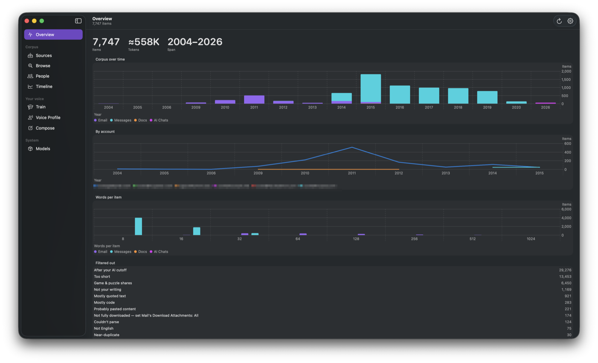
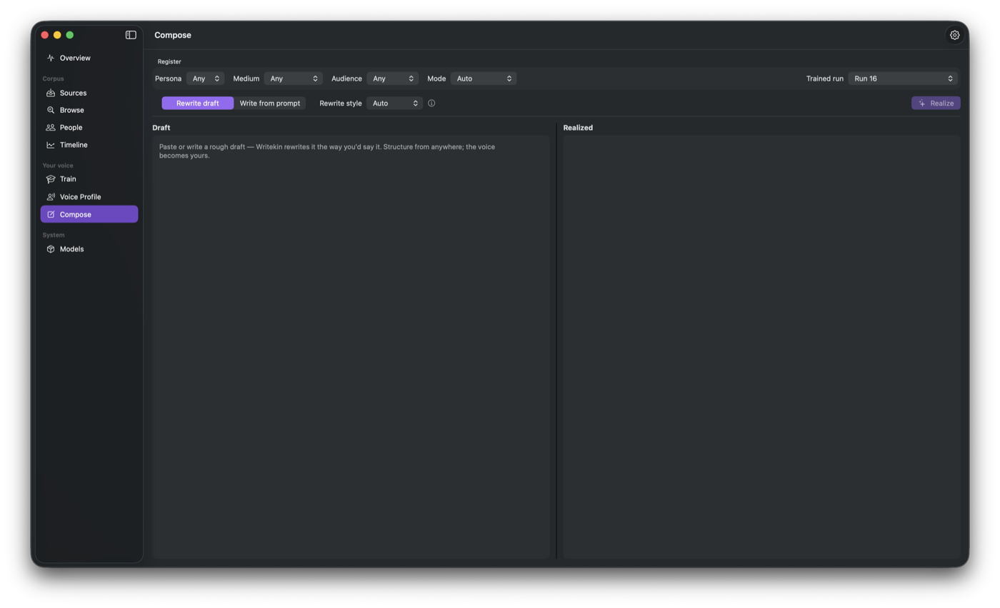
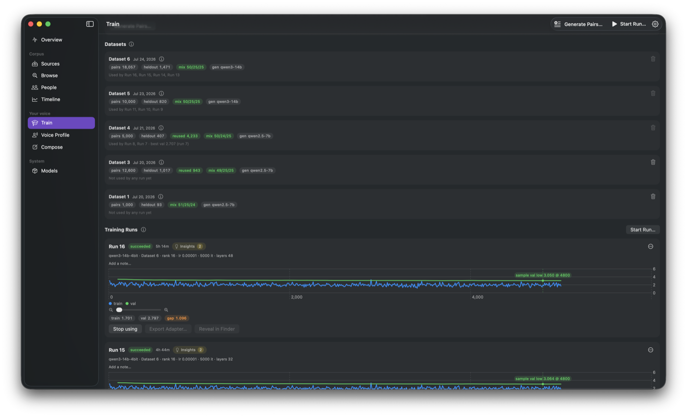
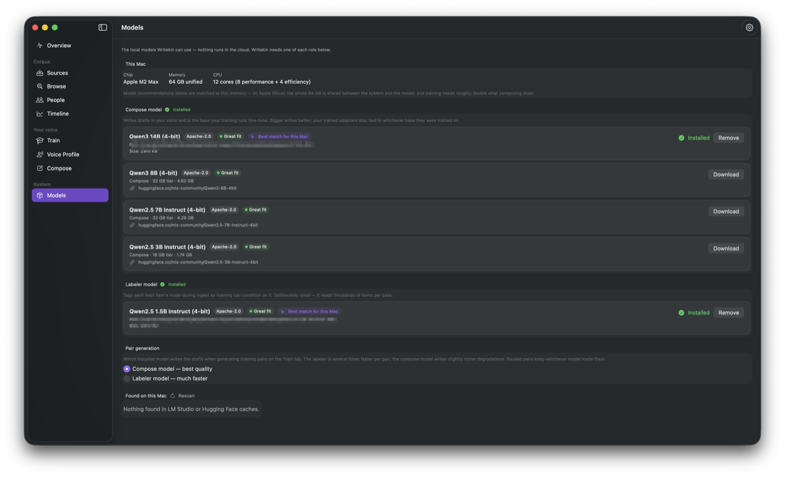

# Writekin

**Writing that's kin to yours.** Writekin ingests your own writing —
Mail, Messages, documents, chat exports — curates it into a training
corpus, fine-tunes a local language model (QLoRA on Apple Silicon via
[MLX](https://github.com/ml-explore/mlx-swift)), and then drafts and
rewrites text that sounds like *you*. Everything happens on your Mac.

## Screenshots

**Overview** — your corpus at a glance.



**Compose** — draft and rewrite in your voice.



**Train** — a local QLoRA run with a live loss chart.



**Models** — the on-device model library.



## Privacy model

- **Nothing leaves your machine.** Ingestion, training, and generation
  are all local. There is no telemetry, no analytics, and no account.
- The auto-update check (Sparkle) requests one file — the release feed —
  and sends no system profile. That is the app's only network traffic
  besides model/tool downloads you explicitly start.
- Model weights download from Hugging Face on demand; the optional
  Messages-support tool downloads from its own official GitHub release,
  checksum-verified. Both happen only when you click.
- This repository exists so you don't have to take any of the above on
  faith: the source is the proof.

## Requirements

- Apple Silicon Mac (M-series). 16 GB unified memory minimum; 32 GB+
  recommended for training larger models.
- macOS 14 or newer.
- Full Disk Access (user-granted) if you want Mail and Messages ingested.

## Install

Download the latest DMG from
[Releases](https://github.com/scouttyg/writekin/releases), drag to
Applications, open. The app guides you through source detection, Full
Disk Access, and model download on first launch.

Messages support uses the open-source
[imessage-exporter](https://github.com/ReagentX/imessage-exporter)
(GPL-3.0), which Writekin downloads on demand — or use an existing
`brew install imessage-exporter`.

## Build from source

```sh
brew install xcodegen
xcodegen generate
open Writekin.xcodeproj   # build the Writekin scheme
```

The full test suite (`xcodebuild test -scheme Writekin`) must pass
before submitting changes — see `CONTRIBUTING.md` (note the contribution
licensing terms there).

New to the codebase? Start with `ARCHITECTURE.md` — the pipeline, the
folder map, and the invariants that keep it honest.

## License

Writekin is **source-available, free for personal (noncommercial)
use** under the [PolyForm Noncommercial 1.0.0](LICENSE.md) license.
Commercial use requires a separate license — see `NOTICE.md` for
contact. Third-party components are listed in
`THIRD_PARTY_LICENSES.md`.
